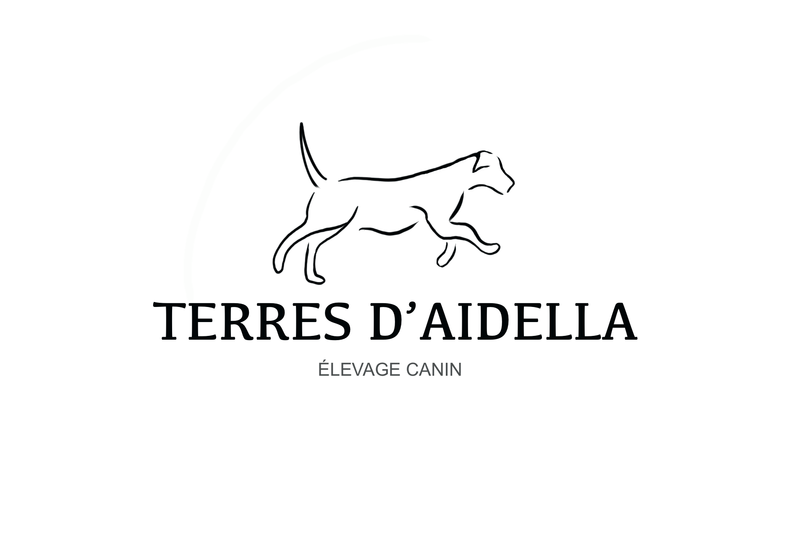

# 🐕 Les terres d'Aidella

**Les terres d'Aidella** is a web application for dog breeders, built with [Laravel](https://laravel.com/) (using the [Orchid](https://orchid.software/) admin panel) and [Vue.js](https://vuejs.org/) for the frontend.

## 🌐 Website

#### [elevage-canin-vosges.fr](https://elevage-canin-vosges.fr/)

## ⚒️ Features

- **Dog Breeds Management:**  
  Add, edit, and manage dog breeds with descriptions, images, and display order.

- **Blog Posts:**  
  Create articles, categorize them, and associate them with dog breeds and categories. Each post supports SEO fields, images, and author attribution.

- **Relational Database:**  
  The database schema is fully relational, with tables for users, blog posts, categories, dog breeds, and images.

- **Admin Panel (Orchid):**  
  User-friendly admin interface for managing all content, including posts, categories, and dog breeds.

- **Frontend (Vue.js):**  
  Dynamic pages for the homepage, dog breed grid, blog post lists, and single post views.

- **Image Management:**  
  Images are stored and managed via a polymorphic relation, allowing each breed or post to have multiple images.

- **CI/CD Pipeline:**  
  Automated testing and deployment using Jenkins.

- **SEO**
  The aim of that webapp was to be seen and to be on top of the search

## 💾 Database Relationships

- Each **DogRace** can have one **BlogPost** (its page) and multiple images.
- Each **BlogPost** belongs to a **PostCategory** and can be linked to a **DogRace**.
- **Pictures** are linked to either a **DogRace** or a **BlogPost** via a polymorphic relationship. Using the builtion Orchid Model Attachment.

## 🔑 Usage

- **Admin:**  
  Log in to the Orchid admin panel to manage breeds, posts, and categories.

- **Visitors:**  
  Browse available dog breeds, read articles, and view detailed pages for each breed. 
  They can also check on all the posts created that will explain how to take care of your dogs, and give tips.

## 🚀 Getting Started

1. Clone the repository.
2. Copy `.env.example` to `.env` and configure your environment variables.
3. Install dependencies and run migrations with seeder using `make install`.
4. Run the project _(launch the frontend and backend)_ ! : `make dev`.

## 📜 License

This project is open-sourced software licensed under the [MIT license](https://opensource.org/licenses/MIT).
